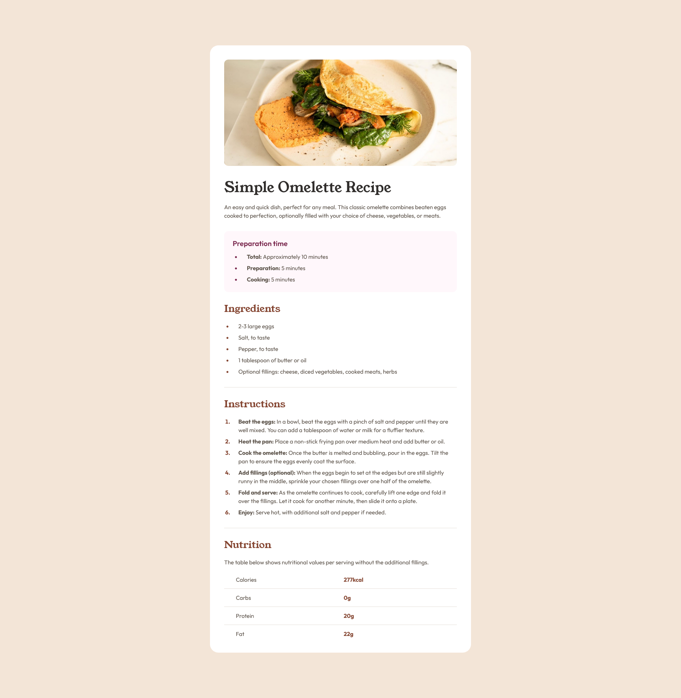

# Frontend Mentor - Recipe page solution

This is a solution to the [Recipe page challenge on Frontend Mentor](https://www.frontendmentor.io/challenges/recipe-page-KiTsR8QQKm). Frontend Mentor challenges help you improve your coding skills by building realistic projects.

## Table of contents

- [Overview](#overview)
  - [The challenge](#the-challenge)
  - [Screenshot](#screenshot)
  - [Links](#links)
- [My process](#my-process)
  - [Built with](#built-with)
  - [What I learned](#what-i-learned)
  - [Continued development](#continued-development)
  - [Useful resources](#useful-resources)
- [Author](#author)

## Overview

### The challenge

This challenge will help you focus on writing semantic HTML. Ensure you think through what HTML elements are most appropriate for each piece of content.

### Screenshot

### Links

- Solution URL: [Frontend Mentor](https://www.frontendmentor.io/solutions/recipe-page-using-tailwind-css-D-Jio2Lwd-)
- Live Site URL: [TBD]()

## My process

### Built with

- Semantic HTML5 markup
- CSS Grid
- Mobile-first workflow
- [TailwindCSS][tailwinddocs]
- [Parcel](https://parceljs.org/docs) - for simple static site building

### What I learned

From previous feedback and looking at feedback of other solutions, I understood I needed to focus more on my markup. I was setting up the markup to focus on styling and the design outcome and not the pertinent content. This time I focused on the content and how to represent that content through the markup.

I also was able to learn some techniques in styling tables and lists, along with navigating the defaults of Tailwind to leverage my styling the way I want it to look.

### Continued development

I need to focus more on the content in the markup and putting styles together with a mobile first perspective and workflow.

### Useful resources

- [TailwindCSS Docs][tailwinddocs]

## Author

- Website - [JYLN](https://jyln.dev)
- Frontend Mentor - [@JYLN](https://www.frontendmentor.io/profile/JYLN)

[tailwinddocs]: https://tailwindcss.com/docs
